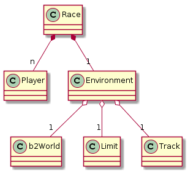
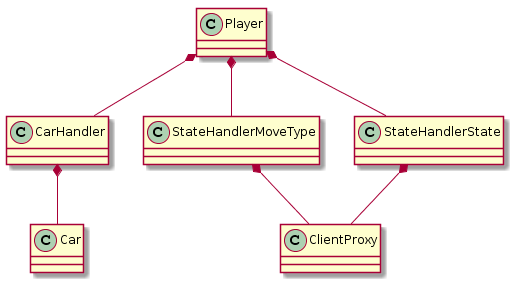
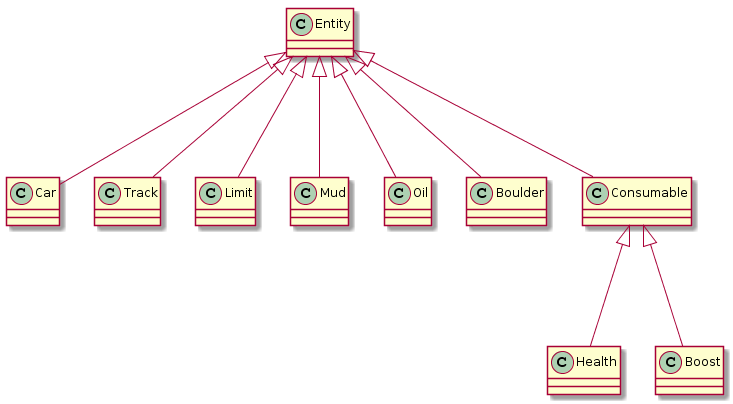

# Micromachines

##Server

### Servidor
El servidor cuenta con un Acceptor de clientes, en el handshake les informa las partidas existentes o si desea crear una nueva, si es así, debe indicar cuantos jugadores serán.

### Carreras
La carrera cuenta con la clase Environment y un vector de Players. En el ambiente están encapsuladas las clases: Limit, Track y la clase propia de Box2D b2World, encargada de simular la física. Cada carrera corre en un hilo diferente y a su vez todos los jugadores participantes de la misma corren en hilos diferentes.





### Entidades
La clase Entity es la clase madre de todos los elementos que componen la carrera, la pista, el borde, los autos y elementos dinámicos. Eston son simulados por el motor físico.



### Autos
Esta clase se encarga de modificar la física del auto y efectuar los contactos con los demás elementos. Para manejar el auto existe la clase CarHandler.

### Elementos extra

Los elementos extras son: 

* Boost
* Health
* Boulder
* Oil
* Mud

Los primeros dos pertenecen a un subgrupo que hereda de Consumable, que a su vez hereda de Entity. Ambos son elementos consumibles que cuando entran en contacto con un auto desaparecen y reaparecen en otro lugar de la pista.
 
### Handler de colisiones

El motor físico brinda una forma para escuchar colisiones entre elementos. Utiliza funciones de callback implementadas por todos los elementos físico, cada uno cuenta con un identificador del tipo `int` con el Listener de Colisiones filtra que hacer con cada uno. Por ejemplo, cuando dos autos chocan llaman a start_contact de cada uno y se efectuan los cambios correspondientes.

### Mensajes
El template de StateHandler se utiliza para enviar y recibir mensajes, en el caso del jugador recibe un movimiento para indicarle al auto y envia un JSON con el update de las posición del auto y otra clase de flags. Cada jugador cuenta con un receiver y un updater, ambas corren en hilos diferentes. El template StateHandler cuenta con una cola bloqueante donde se encolan los mensajes a enviar/recibir. Ambos tienen una referencia a el ClientProxy, ya que no se puede copiar porque contiene un Socket para la comunicación.

## Client

### Diagrama de clases general


### Comunicación cliente - servidor

#### Protocolo

Lo primero que decidimos fué que utilizaríamos un protocolo de texto, ya que nos iba a facilitar a la hora de depurar el juego poder revisar qué fué lo que se estuvo mandando.

Optamos por utilizar el formato JSON para representar el _estado_ del juego. Es decir, el servidor le mandaría al cliente una string representando el estado actual del juego en formato JSON, para que este pueda mostrarlo en pantalla.

Para esto investigamos bibliotecas externas que implementen parseo de JSON. Nos encontramos con esta:

> https://github.com/nlohmann/json

Luego de leer la sección de _"design goals"_ de esta biblioteca, decidimos utilizarla por la simplicidad que ofrecía.

Por otro lado, también existía la opción de serializar un JSON a binario si es que estabamos teniendo problemas de performance.

El formato del estado se vería de esta manera:

```JSON
{
  "cars": [
    {
      "angle": <float>,
      "id": <float>,
      "speed": <float>,
      "x": <float>,
      "y": <float>
    }
  ],
  "center": {
    "x": <float>,
    "y": <float>
  },
  "elements": {
    "boost": [
        {"x": <float>, "y": <float>}
    ],
    "health": [
        {"x": <float>, "y": <float>}
    ],
  },
  "user": {
    "crash": <bool>,
    "end": <bool>,
    "lap": <int>,
    "lives": <int>,
    "mud": <bool>,
    "name": <string>,
    "total_laps": <int>
  }
}
```

De esta manera podemos identificar en qué lugar se encuentra cada elemento del lado del servidor y algunos flags que nos resultarían importantes.

Nótese que no hay ningún tipo de información sobre la pista o mapa. Esto es porque, ya que era algo que no va a cambiar durante el juego, decidimos mandarlo al inicio de la partida, junto a otra información sobre el jugador que se está conectando.

Para lograr este primer intercambio de información, decidimos implementar un _"handshake"_ entre el cliente y el servidor.

### Handshake

Como mencionamos previamente, entre el cliente y el servidor hay un primer intercambio de información que permitirá obtener la información necesaria para comenzar la partida.

Cómo funciona este intercambio de información:

```
1. servidor le envía a cliente las partidas disponibles
2. cliente le envía al servidor la partida seleccionada
3. servidor le envía al cliente la información del mapa para esa partida
```

Información de servidor al cliente sobre la partida que eligió tendrá este formato:

```JSON
{
  "curved": [
    {
      "angle": <float>,
      "x": <float>,
      "y": <float>
    }
  ],
  "elements": {
    "boulders": [
      {
        "x": <float>,
        "y": <float>
      }
    ],
    "muds": [
      {
        "x": <float>,
        "y": <float>
      }
    ],
    "oils": [
      {
        "x": <float>,
        "y": <float>
      }
    ]
  },
  "tracks": [
    {
      "angle": <float>,
      "x": <float>,
      "y": <float>
    }
  ]
}
```

### Implementación

Para lograr una implementación desacoplada de las decisiones de diseño definimos ciertas entidades.

__Socket__

Es la clase que implementa el envío de bytes sobre un socket.

__Communication__

Es la entidad que se ocupa de mandar y recibir texto por un el socket.

El socket solo entiende de mandar y recibir bytes. La responsabilidad de esta clase es transformar estos bytes a cadenas de c++.

__Serializers__

Estas son entidades de un nivel superior a _Communication_, ya que son las que se ocupan de transformar cierto tipo de información a cadenas. Para luego poder envíarlas por _Communication_.

Definimos estos serializers:

+ MoveSerializer
+ RacesSerializer
+ StateSerializer
+ TrackSerializer

Cada uno de estos sabe como transformar la información que se le manda a una cadena, y también desde la cadena que representa la información a los datos que se van a poder usar.

__Proxies__

Por último, la capa que corre arriba de todo esto, es la de los proxies.

Estos saben como recopilar la información y a que serializadores llamar, y también como entender la información que los serializadores les proveen.

Tenemos el proxy que va a usar el cliente: __ServerProxy__

Al cual se le va a poder pedir el estado actual del juego, para luego poder renderizarlo. Además, se le va a envíar el tipo de movimiento que el jugador realizó.

Por otro lado, tenemos el __ClientProxy__. Este va a ser usado por el servidor para mandarle el estado del juego y recibir los movimientos de los jugadores.


### Renderizado de escenarios

Luego de que el cliente recibe el estado actual del juego, envíado por el servidor, este va a tener que dibujar el estado en la pantalla.

### Renderizado de texturas

Para lograr renderizar elementos en pantalla durante el juego se decidió usar SDL.

Para poder hacer uso de las buenas prácticas de c++ se tuvieron que hacer varios _wrappers_ RAII de las clases de SDL.

#### Cargado de Texturas

Para evitar problemas de performance al cargar varias veces la misma textura de SDL, se decidió hacer un cache de estas texturas.

Se creó `SDLTextureLoader`, que sería el encargado de cargar las texturas de los archivos a memoria. Pero además se va a guardar qué texturas fueron cargadas.

Por otro lado, esta entidad va a ser responsable de eliminar las texturas que queden en memoria.

### Renderizado de entidades

Luego de haber diseñado la parte de renderizado de texturas, había que agregarle cierta funcionalidad a los elementos para darle responsabilidad a las clases.

Por lo tanto, se decidió tener una clase por cada entidad del juego que debía ser renderizable.

Cada clase está encargada de conocer cual es la imagen que les corresponde, cuánto mide, etc.

Luego de esto se decidió crear una clase `Renderizable` que es una clase abstracta que contiene los métodos que cualquier entidad renderizable debe implementar.

Por otro lado, se dividen en dos categorías:

1. Entidades estáticas

    Estas son aquellas entidades que son representadas por una imagen.

2. Entidades dinámicas

    Estas entidades son aquellas que vienen con una animación.

#### Camera & WorldEntities

Para lograr manejar las entidades y poder renderizarlas en la pantalla se destinaron dos clases que van a interactuar.

Por un lado tenemos la clase que va guardar infromación de dónde se encuentra cada entidad en el servidor. Esta va a ser `WorldEntities`

Por otro lado, tenemos la clase que va a transformar las coordenadas del servidor a píxeles en pantalla. De esto se va a encargar la clase `Camera`.

Se le va a pasar una entidad y su posición, luego la camara va a verificar si la entidad se encuentra dentro de la pantalla y si es así, renderizarla.

### Hilos Involucrados

Para lograr dibujar, recibir estados y enviar estados fué necesario disponer de tres hilos de ejecución durante el juego.

Utilizando dos de los tres, para implementar un patrón _producer-consumer_.

#### Hilo Principal

De este hilo se desprenden los otros dos. Es el hilo donde va a estar el _"game loop"_.

En este hilo se va realizar el _"handshake"_ entre el cliente y el servidor. Luego se van a instanciar y correr los otros dos hilos.

Luego de todo eso, se escuchan los eventos de SDL para ver que es lo que está haciendo el jugador y se le envían estos eventos al servidor.

En el caso de que ocurra un evento de cierre de juego, este hilo va a parar los otros dos hilos y esperarlos. Luego de esto va a cerrar los recursos y salir de la ejecución del juego.

#### Recibiendo Estados

Por otro lado, tenemos un hilo que va a recibir estados del _ServerProxy_ y los va a encolar en una cola para que mas tarde otro hilo los use.

Este va a ser el hilo _productor_.

#### Dibujando Estados

Por último, tenemos el hilo que va a ir dibujando los escenarios.

Este va a leer de la cola compartida el estado a dibujar y luego lo va a mostrar por pantalla.

Este va a ser el hilo _consumidor_.
