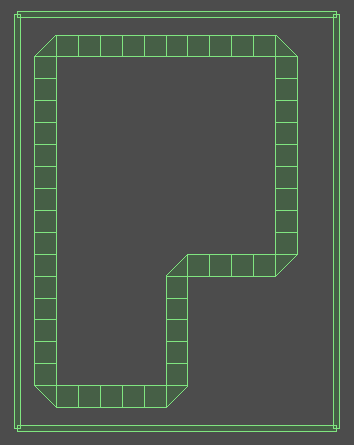
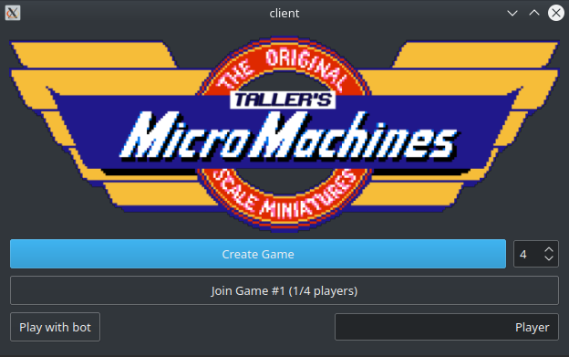

# Manual

## Instalación del juego y sus dependencias

0. Es importante que tanto esto como la subsecuente ejecución de los ejecutables se haga sobre la raíz del proyecto
1. Instalar las dependencias que utiliza el juego: `./dependencies.sh`
2. Crear un directorio donde se compilara todo (y entrar a el): `mkdir build && cd build`
3. Llamar a `cmake` para luego poder generar los ejecutables: `cmake ..`
4. Compilar ambos ejecutables (el que respecta al servidor, y el del cliente): `make server && make client`

## Server

### Inicialización

Para inicializar el server luego de haber corrido las dependencias y compilado los archivos necesarios:

```bash
./server <servicio> <archivo_config.json>
```

Siendo el servicio el número del puerto (o nombre del servicio) donde se estará escuchando y aceptando jugadores, y el archivo de configuración el que contiene la pista a jugar. Una corrida de ejemplo es `./server 7777 track.txt`

El archivo de configuración deberá contener un JSON con la disposición de la pista. La pista está compuesta por tiles cuadradas y triángulos isósceles. Las claves del JSON son "curved", "straight" y "curved_center".

Ej:

```JSON
{
  "curved": [
    {
      "x0": <float>,
      "x1": <float>,
      "x2": <float>,
      "y0": <float>,
      "y1": <float>,
      "y2": <float>
    } ,...
  ],
  "straight": [
    {
      "angle": <float>,
      "x": <float>,
      "y": <float>
    } ,...
  ],
  "curved_center": [
    {
      "angle": <float>,
      "x": <float>,
      "y": <float>
    } ,...
  ]
}
```

En cada clave:

* "straight": En esta clave se encuentran los centros geométricos de las partes rectas de la pista.
* "curved": Siendo las curvas triángulos, los 3 vértices del triángulo en `{"x0": n, "x1": n,"x2": n, "y0": n, "y1": n,"y2": n}`.
* "curved_center": Centros geométricos de las partes curvas de la pista.

### Armado del archivo de configuración 

Para el armado de la pista utilizamos la interfaz gráfica que proporciona Box2D, denominada "Testbed". Y tiene la siguiente forma:



Para reproducir el armado de la pista remitirse a [este repositorio](https://github.com/milenamarchese/Box2D) donde se explica como inicializar la Testbed y como agregar una prueba nueva. El archivo de la prueba a agregar es "FooTest.h".

### Plugins del juego

El juego contiene la posibilidad de cargar plugins (o mods) que pueden codificarse y compilarse por separado, y luego ser cargados en tiempo de ejecución. Estos plugins modifican la comunicación entre el servidor y el cliente, efectivamente haciendo que los jugadores vean componentes del programa de manera distinta. Por ejemplo, se puede hacer un mod que intercepta la comunicación de vidas, y en vez de enviar la cantidad de vidas del jugador, envía siempre que el jugador tiene 1 vida, haciendo que sean todos invencibles. Así, hay infinitas posibilidades (hacer que el jugador siempre vea barro, hacer que el jugador este explotando constantemente, cambiarles su nombre, su cantidad de vueltas, etc).

Para poder ver los mods disponibles, solo hace falta escribir en la terminal el caracter 'm'. Para activar o desactivar los distintos plugins, hay que escribir su número identificador.

```bash
$ m
Available Mods: 
(input the number to activate them)
	1: libAlwaysMud.cpp
	2: libOneLife.cpp
$ 1
<activa un plugin que hace que el jugador vea siempre barrio>
```

Para poder hacer sus propios mods, los usuarios del juego deberán crear un archivo `.cpp` en el directorio `server_src/mods` donde se defina la función `void middleman(char *json)` la cual recibe la cadena del json a enviarle al cliente y la modifica con el nuevo contenido a enviar. Este archivo debe compilarse como una librería dinamica compartida, y esta librería ser agregada al paso de compilación.

### Finalización 

Para terminar con todas las partidas existentes y cerrar el servidor, escribir en la termina el caracter 'q' y se despedirá.

```
$ q
Goodbye!
```

## Cliente

### Iniciar la aplicación

Luego de haber corrido las dependencias y compilado los archivos necesarios, se va a poder inciar la aplicación del cliente de esta manera:

```bash
./client <host> <puerto>
```

Siendo el host la ip de la computadora que esta corriendo al servidor (`localhost` si se hacen ambos pasos en la misma computadora, o `192.168.....` si es dentro de la misma red wifi) y el servicio el número del puerto (o nombre del servicio) al cual se conectará. Una corrida de ejemplo es `./client localhost 7777`

Luego de haber puesto el input correcto (y que el servidor este corriendo en el host y puerto especificados) se abrirá la siguiente ventana:


Aquí vamos a poder especificar el nombre que queremos usar y si quisiéramos usar un bot, podríamos elegir el tipo de bot.

Luego de esto, vamos a crear la partida para comenzar una nueva partida, que será de la cantidad de jugadores que se especifiquen (la carrera no comenzara hasta que todos los jugadores se unan).

Por otro lado, si quisiéramos unirnos a una partida, nos van a aparecer las partidas disponibles para unirnos:



---

### Instrucciones de Juego

#### Movimientos

Una vez dentro del juego, vamos a poder comenzar a mover el auto. Hay tres formas diferentes de lograr moverlo.

1. Avanzar

    Para lograr avanzar vamos a poder tocar la tecla W o bién la flecha "arriba".

2. Doblar

    Para doblar vamos a usar A (izquierda) o D (derecha), o bién las flechas de la izquierda o derecha. 

3. Frenar y Reversa

    Utilizando la tecla S vamos a poder frenar el auto, pero si se mantiene suficiente tiempo apretada va a comenzar a ir en reversa. Otra tecla posible será la flecha de abajo.

También, el juego tiene soporte para joysticks/gamepads. De comenzar el cliente con un joystick conectado en la computadora, se imprimira por pantalla un mensaje de que este fue encontrado, y luego el auto podrá moverse con el analógico izquierdo del mando.

El jugador va a comenzar con tres vidas totales que se irán reduciendo en el evento de que el auto choque contra otro auto, los límites de la pista o las piedras.

#### Obstáculos

Durante la carrera, el jugador va a encontrarse con ciertos obstáculos en la pista, estos van a afectar de maneras distintas al jugador.

##### Piedras

Al chocar con una piedra, el jugador va a perder una vida y ocurrirá una explosión.

Además, la piedra es un objeto sólido, por lo tanto el jugador no va a poder atravesarla y deberá maniobrar alrededor de la misma.

##### Barro

Cuándo el jugador pase por encima del barro, se le va a reducir la visibilidad por un tiempo.

##### Aceite

Cuándo el jugador pase por encima del aceite, se le va a reducir el agarre al auto, por lo que le va a dificultar doblar.

#### Consumibles

Durante la carrera, el jugador va a poder agarrar consumibles que tendrán distintos efectos.

##### Boost

Luego de agarrar un boost, se le va a dar un golpe de aceleración al auto del jugador, lo que lo llevará a ir más rápido por un tiempo.

##### Vida

Luego de pasar por una vida, se va a consumir. Si el jugador no tenía su vida al máximo, esta se le repondrá por una unidad.

### Vueltas

Para terminar la carrera el jugador va a tener que cumplir con el número de vueltas especificado en la pantalla.

Para completar una vuelta, el jugador va a tener que pasar por todas las curvas de la pista. Si se pierde una curva, no se le contará la vuelta como tal.

Luego de terminar las vueltas, se le va a indicar al jugador en que posición quedó.

### Sonidos

Por default los sonidos del juego van a escucharse, pero si se quiere puede presionar la tecla `m` para apagarlos.

### Scripts

El juego proporciona la posibilidad de que se creen scripts o bots para que la máquina juegue en vez del jugador. Estos son desarrollados en Lua, y definen la secuencia de movimientos a hacer. En el archivo `.lua`, en el directorio `client_src/bots`, se tiene que definir una tabla con todos los movimientos a envíar (al final de la tabla, se reinicia el ciclo, por lo que definir `{UP}` equivale a un jugador constantemente avanzando) y una función `getMove` que devuelva el siguiente movimiento a envíar.

