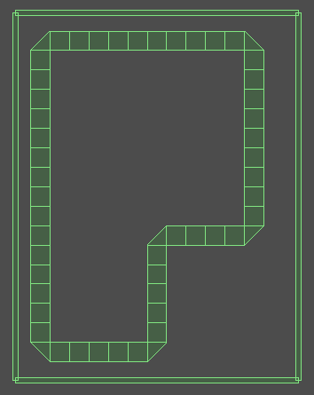

# Server

## Inicialización

Para inicializar el server:

```
$ ./server_test servicio archivo_config.txt
```

El archivo de configuración deberá contener un JSON con la disposición de la pista. La pista está compuesta por tiles cuadradas y triángulos isósceles. Las claves del JSON son "curved", "straight" y "curved_center".

EJ:

```
{
  "curved": [
    {
      "x0": n,
      "x1": n,
      "x2": n,
      "y0": n,
      "y1": n,
      "y2": n
    } ,...
  ],
  "straight": [
    {
      "angle": n,
      "x": n,
      "y": n
    } ,...
  ],
  "curved_center": [
    {
      "angle": n,
      "x": n,
      "y": n
    } ,...
  ]
}
```

Con n siendo del tipo `float` por convención de Box2D. En cada clave:

* "straight": En esta clave se encuentran los centros geométricos de las partes rectas de la pista.
* "curved": Siendo las curvas triángulos, los 3 vértices del triángulo en `{"x0": n, "x1": n,"x2": n, "y0": n, "y1": n,"y2": n}`.
* "curved_center": Centros geométricos de las partes curvas de la pista.

## Armado del archivo de configuración 

Para el armado de la pista utilizamos la interfaz gráfica que proporciona Box2D, denominada "Testbed". Y tiene la siguiente forma:



## MODS


## Como cerrar 

Para terminar con todas las partidas existentes y cerrar el servidor, escribir en la termina el caracter 'q' y se despedirá.

```
q
Goodbye!
```


 